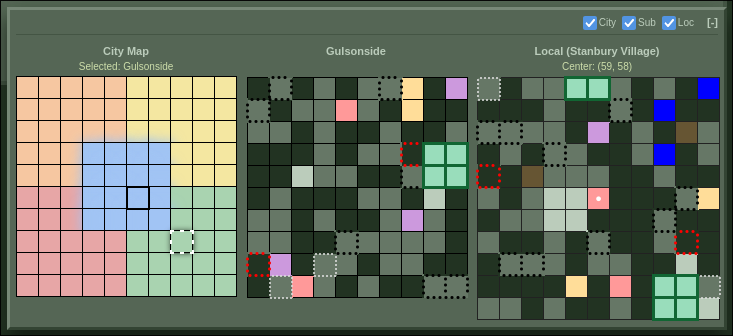

# Tactical Map - WWDead Plugin

A personal fork of **DTTL**'s [Tactical Map Greasemonkey Plugin](https://greasyfork.org/en/scripts/567867-wwdead-tactical-map-v2-0) for [WWDead.com](https://wwdead.com) with some additions and fixes.

## [⚡ Install Tactical Map (v2.0.0-xun.2)](https://github.com/xunoaib/wwdead_tacticalmap/raw/refs/heads/main/TacticalMap.user.js)

You can [compare the full code diff here](https://github.com/xunoaib/wwdead_tacticalmap/compare/upstream-2.0...main) to see exactly what has been modified from the original source.

You may have to click the `Files changed` tab to see the actual content.

> Tested with Greasemonkey 4.13 on Firefox, and reportedly also works on Chrome.

## Screenshot

## Changelog

### [v2.0.0-xun.2]

**Additions**
- Add a local 11x11 map centered on the current player's tile.
- Allow toggling the visibility of each submap, and persist these settings.

**Fixes**:
- Improve global player location detection. Fixes errors on ambiguous tiles (i.e. `a factory`)
- Improve variable scoping and encapsulation of global logic.

### [v2.0.0-xun.1]

**Additions:**
- Show GPS coordinates for other suburb tiles on mouseover.
- Use local storage to remember the collapsed/expanded state of the map.
- Add white dot to indicate the player's current location.
- Add an outline to indicate the currently-selected suburb in the city map.
- Add text indicating whether the given suburb/location is the player's "current".
- Add hover text for each tile indicating building type.

**Fixes:**
- Use a fixed cell size to prevent grid from shifting.
- Fix issue where hovered suburb location text would reset itself.
- Simplify URL matching rules to only target the main "map" URL.
- Ran `npx prettier` to improve readability of source code.
